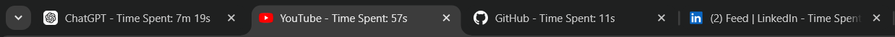
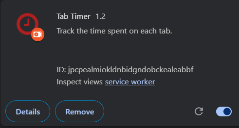

# Tab Timer Chrome Extension

## Overview

**Tab Timer** is a Chrome extension designed to track the time spent on each tab in your browser. It allows you to monitor your browsing habits, manage your productivity, and gain insights into how you use your tabs.

Give me the file in same format 

## Features

- **Real-time Tracking**: Automatically tracks the time spent on each tab.
- **Media Detection**: Pauses tracking when media is playing on a tab.
- **Detailed Statistics**: Provides a summary of time spent on tabs.
- **Customizable Appearance**: Features a customizable landing page with styling and animations.
- **Easy Access**: Access time tracking information through a user-friendly popup.

## Installation

1. **Download the Extension**: [The deployment is underway](#)
2. **Open Chrome Browser**.
3. **Go to Chrome Extensions Page**: Navigate to chrome://extensions/.
4. **Enable Developer Mode**: Toggle the switch in the top-right corner.
5. **Load Unpacked Extension**: Click on Load unpacked and select the directory where the extension files are located.
6. **Verify Installation**: The extension should now appear in your list of installed extensions.

## Usage

- **Tracking Time**: The extension automatically starts tracking time when you switch tabs and stops tracking when you close a tab.
- **Viewing Statistics**: Click on the extension icon to view a detailed summary of time spent on each tab.
- **Settings**: Adjust settings through the extension’s landing page to customize your experience.

## How It Works

1. **Background Script**: Handles tab switching, updates, and closures to accurately track time.
2. **Content Script**: Monitors and interacts with web pages for various functionalities.
3. **Popup Page**: Provides a quick view of time tracking statistics and other relevant information.

## Screenshots

## Contributing

We welcome contributions to improve this project. If you have suggestions, bug reports, or feature requests, please open an issue or submit a pull request on GitHub.

### How to Contribute

1. **Fork the Repository**: Click the Fork button on the repository page.
2. **Clone Your Fork**: git clone https://github.com/yourusername/tab-timer.git
3. **Create a Branch**: git checkout -b your-feature-branch
4. **Make Changes**: Implement your changes and test thoroughly.
5. **Push Changes**: git push origin your-feature-branch
6. **Submit a Pull Request**: Go to the repository page and click New Pull Request.

## Contact

For any questions or further information, please contact:

- **Email**: icoomkarofficial66@gamil.com
- **GitHub**: [Your GitHub Profile](https://github.com/Ombiradar07)

---

Thank you for using the Tab Timer Chrome Extension!
